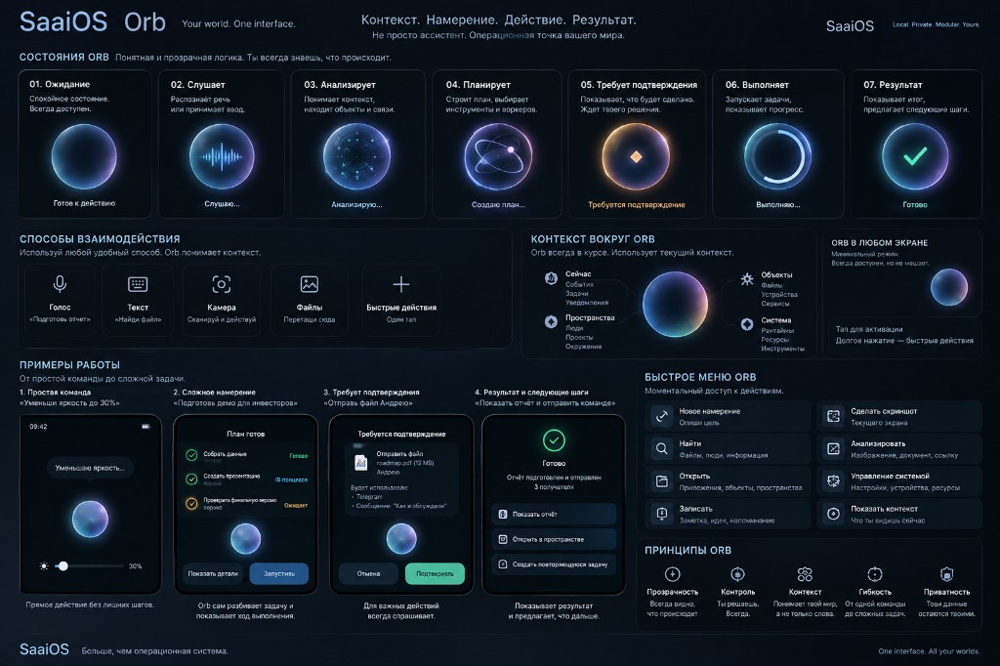
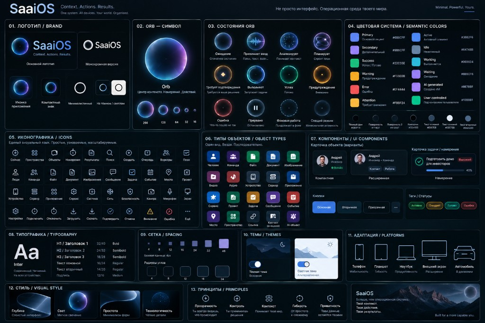
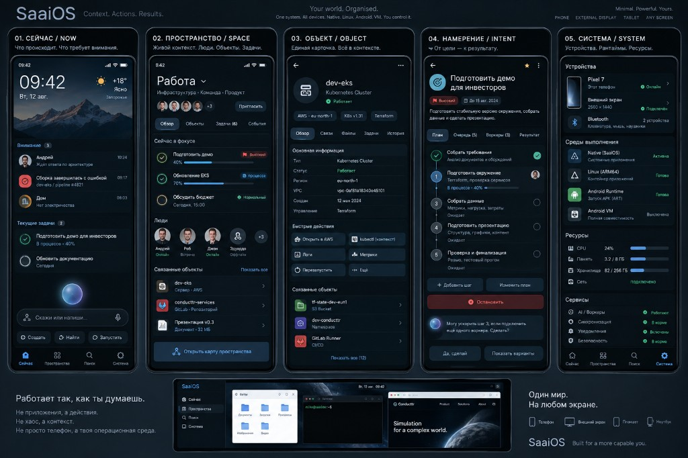

# Product visual target — first version

Status: **accepted product destination for UI v1**, 2026-09-18.
These boards are the reference, not a screenshot of the current Pixel shell.

Implementation remains incremental: Visual Language / VUI owns tokens and
components; HIA owns objects and behavior; WSV2 owns workflow. No board pixel
is a license to invent agents, fake telemetry, voice, or Android VM.

## Boards







## What v1 is

SaaiOS first version is an **operational environment**, not a chat home and
not an app launcher.

Slogan on the boards is the product contract:

```text
Контекст. Намерение. Действие. Результат.
```

Five surfaces, one footer:

| Surface | Job | Backed by |
|---|---|---|
| **Сейчас** | What needs attention, current work, next action, composer | workflow + events + Orb |
| **Пространство** | People, objects, tasks in one context | SOM `in-space` / members |
| **Объект** | One object: facts, related, actions | SOM Object View + OAM |
| **Намерение** | Goal → plan → progress → result | IRAB + WSV2 Task DAG |
| **Система** | This device, runtimes, resources, services | DeviceState / settings |

Footer on the boards: `Сейчас · Пространства · Поиск · Система`.
`Входящие` is not a primary tab in v1; attention lives on `Сейчас`.
`Поиск` is a domain, not a sixth OS. Object View is reached from Space/Search/NOW, not as a tab.

## Orb

Orb is the **operating locus**: always available, never a second product.

v1 states on the board map to real workflow, not moods:

| Board | Means |
|---|---|
| Ожидание | idle, ready |
| Слушает | voice capture — **visual destination**; Pixel voice remains hardware-blocked |
| Анализирует | IRAB / deterministic resolve |
| Планирует | Planner `PlanProposal` |
| Требует подтверждения | `WaitingConfirmation` |
| Выполняет | Task/Action running (WSV2) |
| Результат | verified Result, next step |

Orb does **not** schedule, authorize, or spawn workers. UI may show
«план готов»; Scheduler still validates the DAG. Confirmation still
asks per dangerous Action. Worker success is not Verification.

Quiet Orb stays small on every screen. The larger Orb on `Сейчас` is
the composer, not an assistant avatar.

## Direct action vs plan

The four examples on the Orb board are the v1 interaction grammar:

1. **Direct** — `Уменьши яркость до 30%` → one OAM action, no DAG.
2. **Plan** — `Подготовь демо…` → PlanProposal, user sees steps, then launch.
3. **Confirmation** — send/delete/charge still AskUser; plan does not bulk-allow.
4. **Result + next** — show outcome and offer the next Intent, do not dump chat.

Caption «Orb сам разбивает задачу» is **presentation**. Decomposition is
Planner proposal + Scheduler validation (ADR-121).

## Workers on the Intent screen

Board labels `Очередь` / `Воркеры` mean:

```text
Очередь  = derived ready / pending Tasks
Воркеры  = disposable WorkerExecution slots
```

They are not persistent personalities (`ResearchAgent`, …) and not a
second source of truth. v1 may show 0–1 active mutating execution.
Do not add `saaios.worker` entities to ship this screen.

## Honest v1 vs later family

On the boards, keep as **destination family**, not Pixel acceptance:

- Voice / long-press Orb listen — AoC / HIA voice track
- Android Runtime / Android VM rows — APP-COMPAT
- Notebook, external display, car — later surfaces; phone remains the v1 gate
- Light theme, blur, rich wallpapers — only if compositor + contrast allow
  (Visual Language: opaque-first)

Missing runtime → truthful empty/unavailable, never a painted fake cluster.

## Visual system

Board 2 is the visual source for tokens and iconography. It does not
override [visual-language-v1.md](../architecture/visual-language-v1.md)
on safety, truthfulness, or “no invented activity”.

When a hex on the board and a VUI token disagree, VUI token + Pixel
panel check win for shipping code; update the token with evidence
rather than hard-coding the poster.

## Not a new sprint

This file does not reopen S00–S32 and does not become S33.
Delivery: [VISUAL-ROADMAP.md](../sprints/VISUAL-ROADMAP.md) (look/components),
[WORK-ROADMAP.md](../sprints/WORK-ROADMAP.md) WORK-08 (workflow visibility).
One hardware-changing experiment at a time.

## How the boards land in existing sprints

Do **not** start a parallel “concept implementation” track. Each board
region already has an owner sprint. Ship one truthful surface at a time;
missing runtime stays empty.

| Concept | Existing sprint | What to ship | What not to ship yet |
|---|---|---|---|
| Tokens, type, icons, object-type glyphs | **VUI-02** (almost done) | Library, not screens | Poster hexes overriding calibrated tokens |
| `Сейчас` attention + current work + composer | **VUI-03** done; deepen later | Real attention/work rows | Fake weather/cluster if sources are missing |
| Footer, status, compact Orb on every screen | **VUI-04** (in progress) | Stable nav + quiet Orb | Do not rip out `Входящие` mid-sprint; `Поиск` / `Я`→`Система` is a later bounded nav slice |
| Orb states: confirm / run / result | **VUI-04** + **WORK-08** | Map to `UniversalState` + workflow status | Listen/voice as if AoC were open |
| Object card, related, quick actions | **VUI-05** | Object View + OAM actions that exist | Invented AWS/kubectl buttons |
| Intent plan / queue / workers | **VUI-05** visuals + **WORK-08** data | Plan steps from Tasks; 0–1 active execution | Persistent Agent personalities; `Воркеры (3)` without runtime |
| Space: people, objects, focus tasks | **VUI-05** / Space surface after VUI-04 | SOM members + real tasks | Invite/cluster chrome without protocol |
| `Система`: device, resources, services | **VUI-06** | Pixel identity, storage, brightness, wifi… | Android VM / notebook / car rows as live |
| Empty/offline/confirm/failed patterns | **VUI-07** | Truthful states | Decorative blur/glow |
| Orb motion, progress arc | **VUI-08** | Measured motion | Continuous glow / fake activity |
| Direct brightness vs plan vs confirm | **IRAB + OAM + ADR-032** already; UI copy in VUI-05 | Same three paths, concept chrome | Bulk «allow all steps» |
| DAG, ready set, verification | **WORK-01…07** host-first | Then WORK-08 shows it | Phone scheduler dashboard |
| Linux/Android runtimes on Система | **APP-COMPAT** | Unavailable until real | Painted green “Готово” |

Order stays the process rule: finish the current Visual hardware slice
(VUI-02/04), then Object/Intent/System screens, then WORK-08 on Pixel.
Host WSV2 may continue in parallel because it does not change the phone
artifact.

